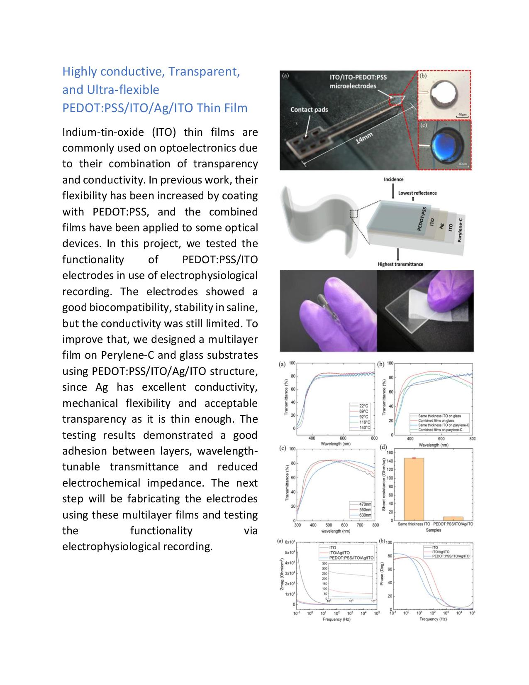
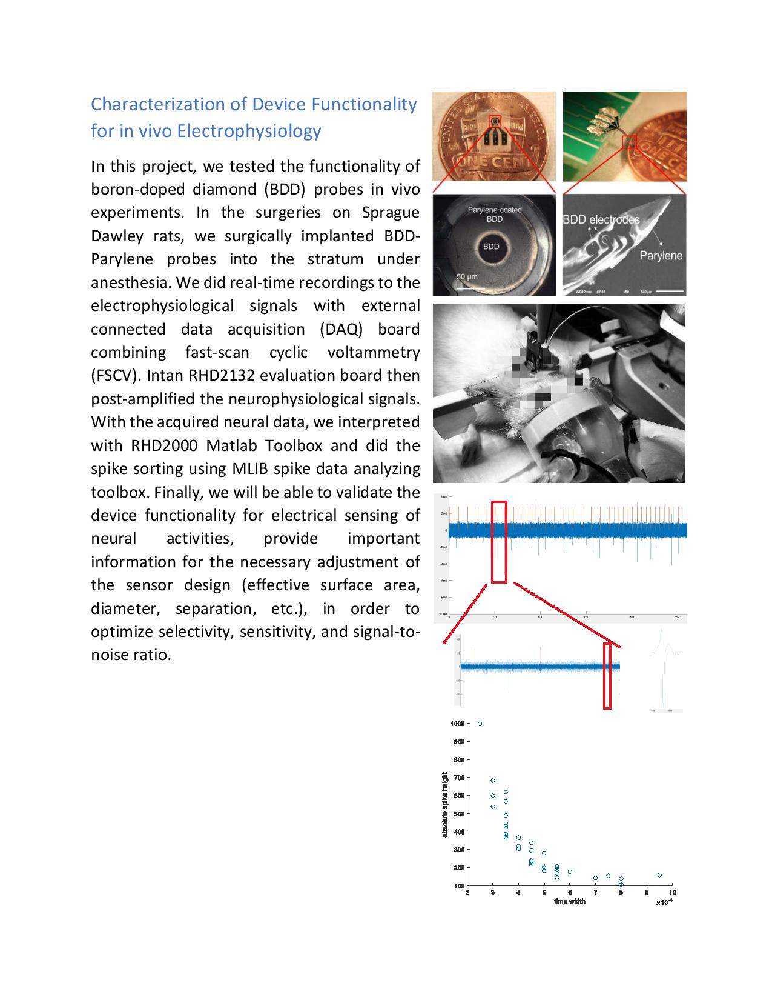
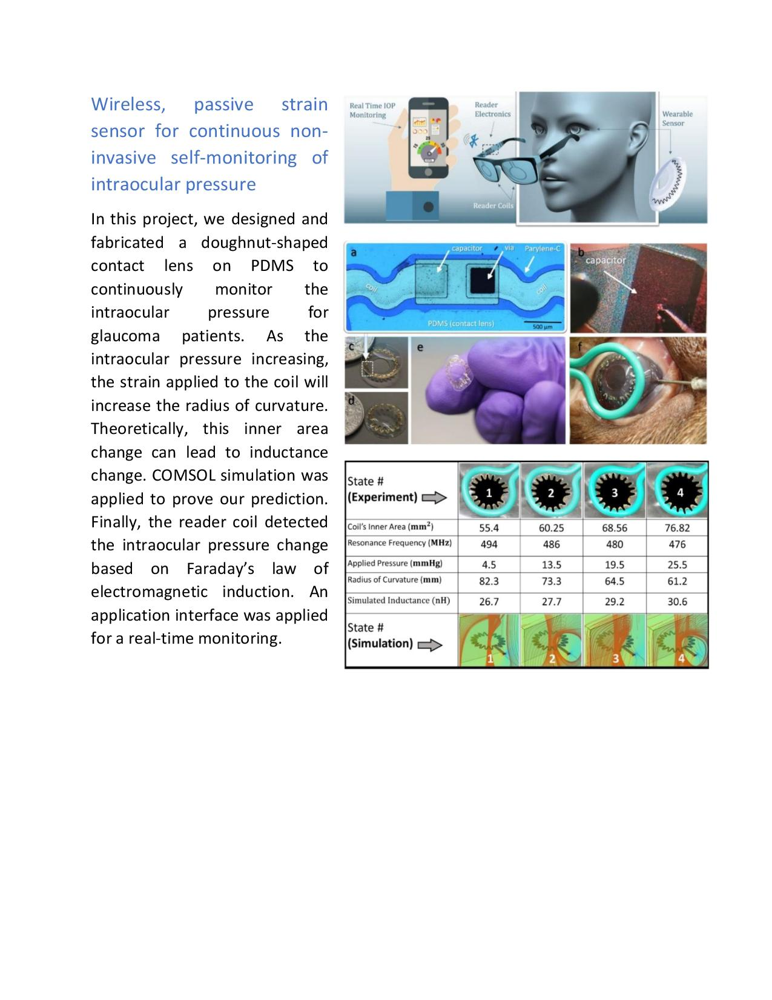
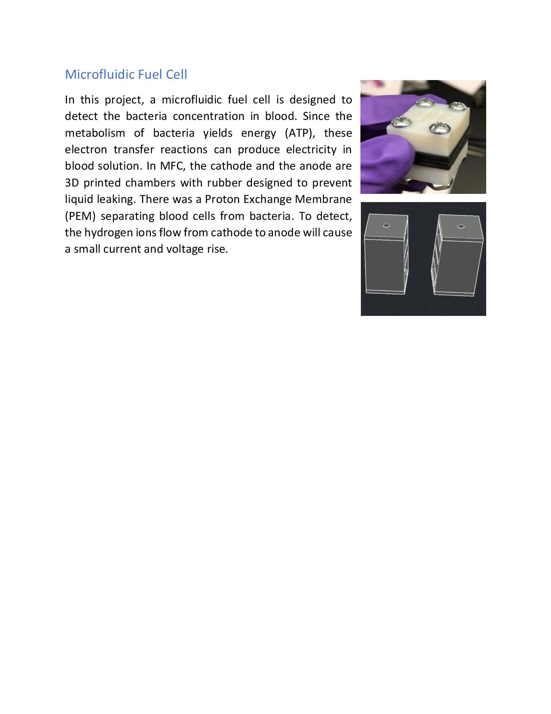
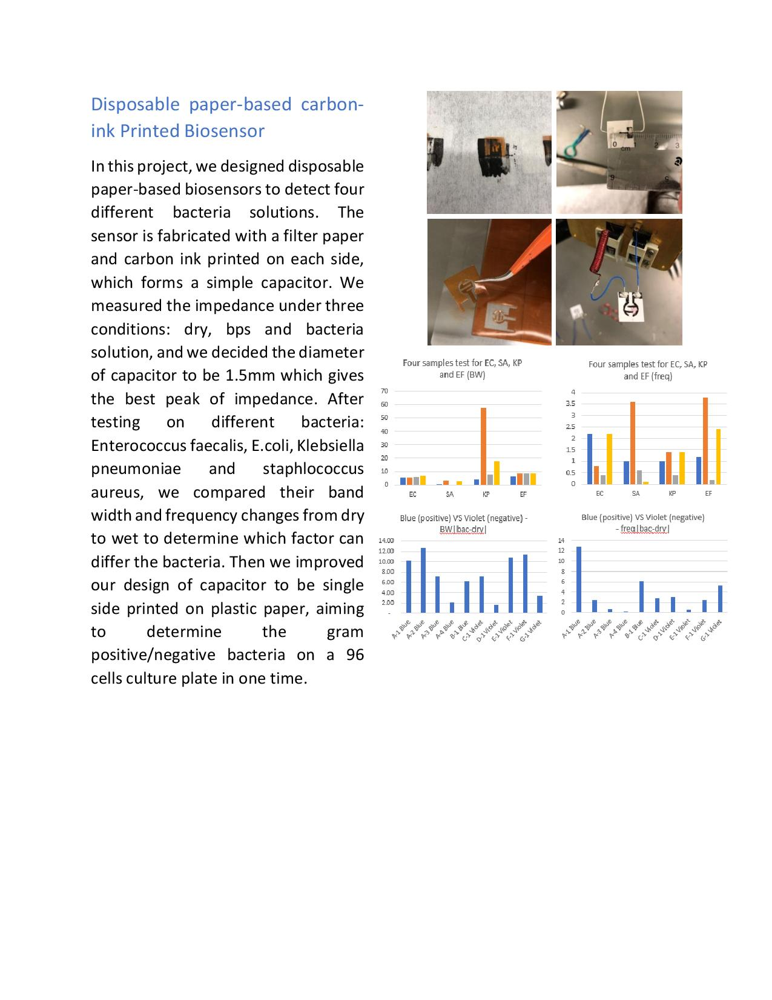
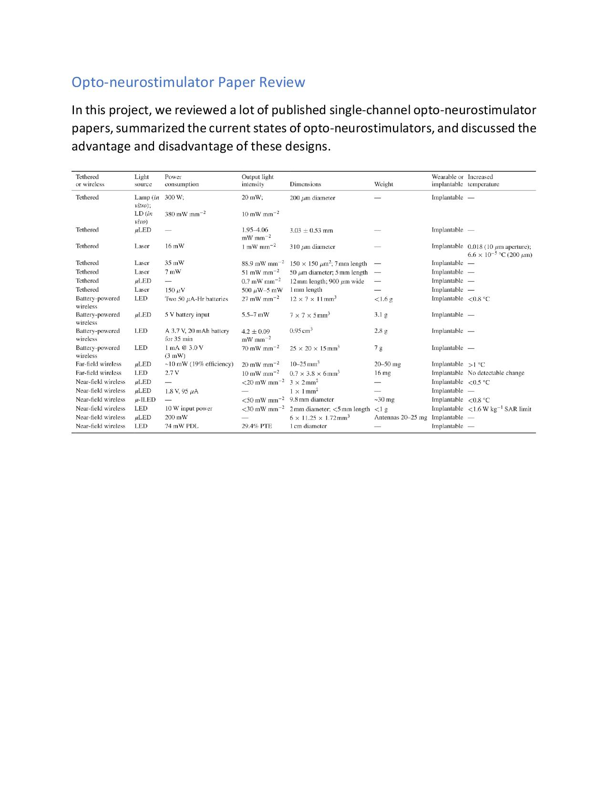
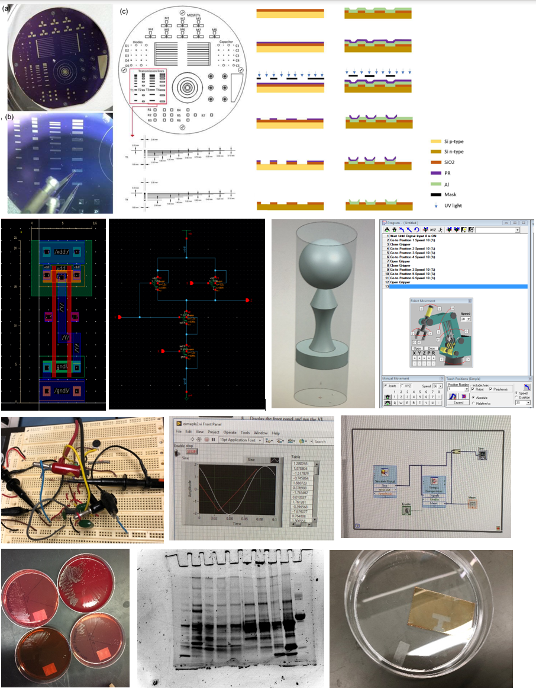

## Portfolio

---

## Work EXPERIENCE

**Optogenetic Probes**

---

**BDD Probes**

---

**IOP Sensor**

---

**Microbial Fuel Cell**

---

**Carbon Ink Printed Sensor**

---

**Opto-neurostimulator Review**

---

### Publications

<!-- [Project 1 Title](/sample_page)

---
[Project 2 Title](/pdf/sample_presentation.pdf)

---
[Project 3 Title](http://example.com/)

---
 -->
[**Characteristics of Transparent, PEDOT:PSS Coated Indium-Tin-Oxide (ITO) Microelectrodes**](./pdf/Characteristics%20of%20Transparent%20PEDOTPSS%20Coated%20ITO%20Microelectrodes.pdf)

[**Single-channel Opto-neurostimulator: A Review**](./pdf/Single%20Channel%20Opto-neurostimulators%20A%20Review.pdf)

[**Highly Conductive, Transparent, and Anti-reflective PEDOT:PSS/ITO/Ag/ITO on Rarylene-C with Tunable Peak Transmittance**](./pdf/Manuscript_Weiyang%20Yang_Final%20version.pdf)

[**Transparent and Ultra-flexible PEDOT:PSS/ITO/Ag/ITO on Parylene Thin Films with Tunable Properties**](./pdf/Transparent%20and%20ultra-flexible%20PEDOTPSS%20ITO%20Ag%20ITO%20on%20Parylene%20thin%20films%20with%20tunable%20properties.pdf)

[**Wireless, Passive Strain Sensor in A Doughnut-shaped Contact Lens for Continuous Non-invasive Self-monitoring of Intraocular Pressure**](./pdf/Lab%20on%20a%20chip%20Manuscripts_Wireless%2C%20passive%20strain%20sensor%20in%20a%20%20%20doughnut-shaped%20contact%20lens.pdf)
also submitted to Microsystems & Nanoengineering, Science Advances

---

### Technical Skills

**Electronics & Computer Lab**

- *Analog & Digital Circuit Design*
- *Cleanroom Microfabrication*
- *AutoCAD, NX CAD & 3D printing*
- *G-Codes & Robotics*
- *PLC design, PSPICE, VHDL, Cadence Virtuoso (IC, VLSI)*
- *Keil, Eagle (PCB design)*
- *MATLAB, C Programming*
- *Sentaurus Workbench, COMSOL Multiphysics, LabVIEW*

**Biology Lab**

- *SDS-PAGE and Bradford for Proteins*
- *Acidic Iodine and Benedict for Carbohydrates*
- *Plate Techniques, Gel Electrophoresis*
- *PCR*
- *Restriction Enzyme Digestions*

---

